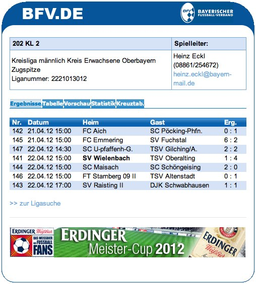

.. ==================================================
.. FOR YOUR INFORMATION
.. --------------------------------------------------
.. -*- coding: utf-8 -*- with BOM.

.. include:: ../Includes.txt

What does it do?
================

This extension embeds a widget provided by the BFV (Bayerischer Fußballverband, http://www.bfv.de) that displays information about a football league.

	BFV widget in the frontend with latest results as selected tab and a team highlighted
