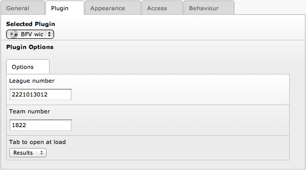

.. ==================================================
.. FOR YOUR INFORMATION
.. --------------------------------------------------
.. -*- coding: utf-8 -*- with BOM.

.. include:: ../Includes.txt

.. _users-manual:

Users manual
============

Usage of the extension is as simple as one can imagine:

- Install the extension.
- Add the plugin to the desired page.
- Enter league number in the options flexform; additionally enter a team number (for highlighting of your favourite team) and change the default tab shown when the widget loads.

	Plugin options in the backend

Note: To use the widget on a website it is required to register your website at the BFV website; to do so, go to http://www.bfv.de, navigate to the league you wish to use and click the link that says “Diese Liga als BFV-Widget auf meiner Homepage anzeigen”; on the following page, you can login or register as a new user and then use the widget.

Additional information is provided after login at the BFV widget in the form of two documents: one containing the terms and conditions, the other one being a technical documentation on using the widget. Both documents are also available from the extension's page at Forge (http://forge.typo3.org/projects/extension-retiolumbfvwidget).
